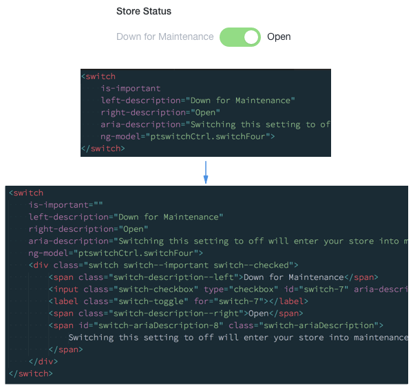

Front End style guides have been well publicised recently, with [many](http://styleguide.cfapps.io/) [examples](http://ux.mailchimp.com/patterns) being [made](http://style.codeforamerica.org/) [available](http://rizzo.lonelyplanet.com/styleguide/design-elements/colours) for all [to see](https://www.lightningdesignsystem.com/). They're a popular and effective way of creating usage guidelines for Interfaces that adhere to an agreed upon design ethic. They help you speed up, maintain, and keep UI consistency. At BigCommerce, we've started to think about the best way we could implement something similar that would help us achieve those goals.

## Style Guides Often Fail

Style guides in our experience fail most of the time as they become stale reference sites that people copy and paste from but never update. They can be too loose, and allow too much freedom; effectively you skin Bootstrap and everyone thinks they're a designer.

There are some situations of course, where you're lucky enough to be able to dedicate resources and a team to solely working on your style guide and shaping its direction. Many of us aren't that lucky, but if by some miracle you manage it, the next most likely thing that will ruin all your dreams is **mutations**.

A lack of an effective integration guide will cause your style guide to become obsolete, as teams will deviate from your agreed approach, making any upgrade path impossible. These mutations more often than not appear because it's _really_ easy to copy, paste, add an additional CSS class to a component and create some variation of it from the core library. Often the excuse is "it didn't quite feel right", or "just because" but this has a serious detrimental effect on your ability to maintain a consistent look and feel, and familiar interaction patterns in your application or website; especially if you are dealing with hundreds of pages. Those small mutations mean any significant change to a component won't roll out. The changes you've made will mean new upstream CSS changes will not take effect due to the cascade and you'll quickly create fragmentation and a frankenstein of an interface, introducing technical and design debt to your system.

This essentially leads to the origin of the naming – a Laboratory, not a Library. This takes a lot of inspiration from the [Pattern Lab](http://patternlab.io/) project and the Atomic Design system. Essentially, this thing should **live**. It shouldn't just be a library piece; something that sits on the design departments shelf to look at every now and then. It should be constantly worked on and iterated over. It should enable us to push new ideas on our design patterns to our app quickly and easily, which means it's necessary that we deal in and produce production code. That production code is not only used to build the pattern-lab itself, but also the application it describes. A single source of truth, what you see is what's in production and what the Engineers on your team are using. 100% confidence.

## Defining What is a Pattern-Lab

A Pattern-Lab is a set of very well defined, strict guidelines and patterns designed solely for a very specific domain. It's not a one-size fits all framework to build something BigCommerce-esque, but a razor-sharp, narrow focused toolkit to build a particular part of the BigCommerce eco-system; in particular, for our Control Panel. We specifically wanted to set out that if an internal team was building something that's not the control panel, and they found they were missing significant chunks of UI, rather than doing a hack job they may benefit from building their own Pattern-Lab for that specific domain.

A Pattern-Lab is designed to only have what we want the delivery teams to have to build that domain. Nothing more, and hopefully nothing less. We plan to build a Pattern-Lab to serve each domain separately, as they will all have different design aesthetics based on their purpose, but most likely a very similar set of core components and patterns. That's where Citadel, our CSS framework, comes into play. More on that in another post.

A Pattern-Lab probably get's you 90% of the way for each domain, but that's not to say a Pattern-Lab is inflexible. Product Managers and Designers love a "Snowflake", so we expose all the global and component maps, variables and mixins, with their corresponding Pattern-Lab "theme", to enable a consuming app the ability to build custom Components, which look right at home and on brand with the wider app domain.

A Pattern-Lab is a joint effort between the design team and engineering, but it is certainly not an engineering tool. It should be lead and owned by the design team. The Pattern-Lab shouldn't just be a documentation site where engineers pick out code snippets, although code snippets are included. It should include the design thinking and language behind the "why" and the "when" a particular pattern should be used. Why you should use a colour for a certain situation, when you should use a certain level of alert, the situations it's appropriate to use a modal etc. Other areas worth considering are defined animations and rules around how and when to use them in the application or interaction.

Again, the Pattern-Lab should describe how to build the best possible experience for our product and for that to be a success, it requires rules around how to use it. Think of it as an appropriate use guideline, or an interaction playbook. We're not quite there yet, but we're well on our way to defining a solid design language and guidelines on how to implement it in our app.

## Living in a Componentised World

The work by Lonely Planet on their "[living style guide](http://engineering.lonelyplanet.com/2014/05/18/a-maintainable-styleguide.html)" [Rizzo](https://github.com/lonelyplanet/rizzo), seems like the natural progression in the style guide world, so we set about defining a way that we can do the same within the context of how we currently build our Control Panel. The beauty of modern JavaScript frameworks, React, Ember and what we use at BC, Angular, is that they're all aligning pretty strongly to the concept of Web Components. Directives, in Angular speak.

This allows us to define small chunks of our UI into standalone, dynamic pieces, that we can then stitch together. It offers a number of advantages, in that each piece is testable separately from other components. We get to abstract complex HTML patterns, semantics and accessibility attributes away from JavaScript engineers who just need implement custom tags or elements into their apps.

With that, we get full control of that HTML as it's compiled into JavaScript objects, meaning we can update a component and rollout it out without the dreaded "find and replace" across thousands of lines of slightly differently formatted HTML.

The JavaScript engineers also get to only concentrate on the things they really care about – application logic, architecture, and performance. The UI and design teams get to own a significant chunk of user interaction and accessibility best practices, which is exactly what they care about the most.

We're now getting closer to solving the problem of our style guide going out of date, by building components for our guide that get used in production. Solving for mutations is a little more tricky, but from my observations, engineers are less inclined to add a CSS class to a custom element when they could just paste in "normal HTML". Which is somewhat of a win.

Because it's JavaScript code, Sass and compiled CSS we can start to think of our Pattern-Lab as a small software project. With that comes the ability to create releases and version tags that we can use to help distribute our code and provide a controlled method of upgrade to our apps by treating the Pattern Lab as a dependency.

## Design Language as a Service

The neat thing about a versioned design language is that it gives the teams some advantages in control, predictability and workflow. By adopting Semantic Versioning (or SemVer), we give our teams control over how they work with our design language by deciding what version they are using for their particular product area. They get predictability as they know we're not going to push a change to them that will break all of their things without them knowing, which would make a very unhappy and stressed engineering team.

Predictability and control leads to confidence in your design language and more stable estimations for the project teams, which is super important in enabling them to ship things on time. With confidence comes adoption. Teams are willing to include the design language in their product area, and because change is predictable, are actively engaged and _encourage_ the evolution of those patterns to make their product areas better. WIN!

Another strong feature of versioning and distribution is testing. With good design comes iteration as you learn and refine your patterns to create to best possible product experiences. Componentisation not only allows you create quick, high fidelity prototypes for your usability and design research, but it can also potentially allow you to split test versions of certain components as you release beta or pre release versions of the Pattern-Lab.

We're somewhat lucky in that we're aiming for a more service orientated architecture in our main app, which also includes Front End code. We build single page apps for each section of the control panel as we systematically upgrade the platform, using common core libraries to build each "micro-app", and then stitch them all together to make one Control Panel. This means we can potentially run minor updates to our Pattern-Lab in certain parts of the app and not others.

What that allows us to do is feed in improvements to a particular component in the Lab, based on the research and testing we've done. We can split test that update in a small part of the application with real users and track any improvements to task completion that we identify as important metrics. This could be huge when thinking about a long term design language where we slowly iterate over design rather than attempting a "big bang" re-design every 3-4 years. No users like big changes and giving us real data in a low risk manor on our design thinking is a massive win towards a happy product experience.

## Our Progress

Have we made much progress towards our utopian future? Not exactly, no. We've definitely made progress, just nowhere near as much as we would have hoped for, for a number of reasons.

We have a fairly broad set of building blocks; elements and slightly more complex components which we've used to build a number of new sections of the app with great success. But what they're really missing is the glue that's used to stick them all together into more rich patterns and layouts. The rules, the guidelines, the do's and don't. In "atomic design" speak, we've built a bunch of atoms and molecules and not a lot of anything else, and what we're finding is that _that_ is the really important stuff to making our teams successful. Over the coming months we'll be addressing just that, to help our project teams build more high fidelity features, more quickly and with less guessing.

In terms of the technology choice itself, we might start to rethink the whole approach. We're still convinced that components are the best way forward, but we're struggling with adoption, since only about 5% of the app is converted over to Angular.

As a UI platform team we're pondering if Angular is the best choice for us to be providing our components in. Mainly because Angular is so "all in" on the "Angular way" of doing things, it really leaves no flexibility in implementation. Even if your project is super simple, it has to be a full blown single page Angular app, with all the abstractions and conventions that come with it. Some of our teams are resource and time lucky, meaning a full re-write in Angular is completely feasible. Other teams are not so lucky; they may lack time or Angular expertise making a full re-write seem overkill or unnecessary.

I think we should definitely still provide JavaScript components but perhaps the "framework" buy-in is holding us back. I'm personally fairly confident that a more lightweight utility; a view or component library like [React](https://facebook.github.io/react/), [Riot](http://riotjs.com/) or [Skate](https://github.com/skatejs/skatejs), would be better suited to our needs. Simpler abstractions, boiled down to encapsulated custom elements which consist of plain DOM elements, coupled with event and callback hooks that respond to users interacting with them. Whatever JavaScript framework you use (or don't use) to control the data layer, can then hook into these and starting piecing them together to build apps. Essentially just a collection of serialisable DOM elements, with a nice developer API and no framework specific conventions to opt into. Pattern-Lab itself then becomes a much more self service tool and really wouldn't care about your technology stack.

That's obviously a pretty big stretch goal and the project as a whole is super ambitious, but that's not going to stop us from trying. For a sizeable app like BigCommerce we think it's super important in enabling our product and engineering teams to deliver new and improved features quickly with less re-inventing, and keeping our UI manageable.
