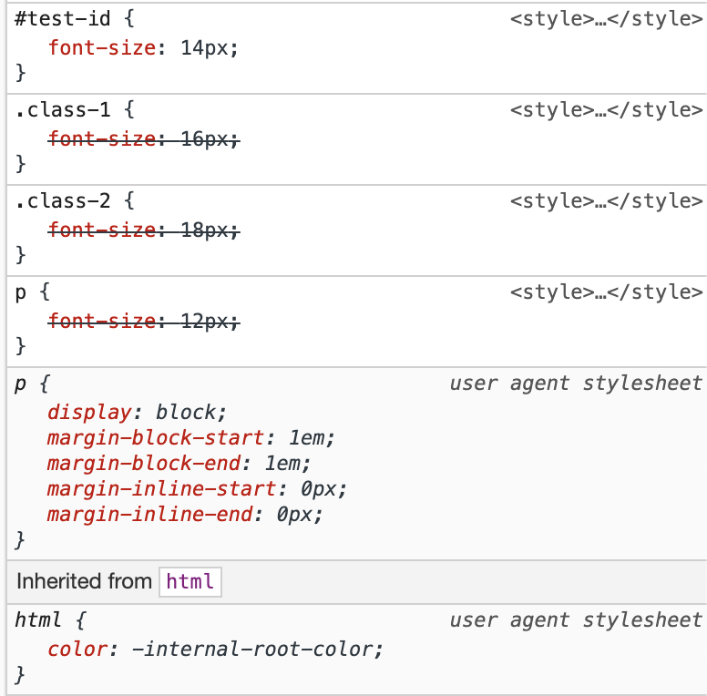

_**Edit June 3rd 2019:** It was pointed out to me that the code example I was using was infact referencing inheritance and not the cascade, technically. Doh! So I've switched the example to actually show the cascade this time, but the article still holds the same conclustion and point. Just goes to show why CSS is so tricky to handle 😉_

<blockquote class="twitter-tweet">
I&#39;ve been writing CSS for 20 years. The example given in that article has nothing to do with the cascade. &quot;The cascade takes an unordered list of declared values for a given property on a given element&quot; *Given element* is key when we talk about the cascade <a href="https://t.co/v2K12JHxM3">https://t.co/v2K12JHxM3</a>
&mdash; Verlan (@ztnelboKyrreihT) <a href="https://twitter.com/ztnelboKyrreihT/status/1135734895836196864?ref_src=twsrc%5Etfw">June 4, 2019</a></blockquote>

---

I’ve been writing CSS for over 13 years. I’ve written CSS for very large news websites, high traffic blogs, micro-sites, small software applications and massive enterprise software applications.

I’m part of the “old guard”. I’ve been around the block enough to know how good it was in the “old days”. To know it was simpler back then. I’ve wrangled IE5.5, I know “how good these kids have it these days”.

In almost all but small, document-based website cases, I can tell you from experience that the cascade is kind of a terrible idea for today’s teams, organisations, and products, and it’s got _nothing_ to do with _“not knowing CSS”_.

## What is “the cascade”

Let’s start by defining what the cascade is. According to [MDN](https://developer.mozilla.org/en-US/docs/Web/CSS/Cascade):

> The **cascade** is an algorithm that defines how to combine property values originating from different sources

> Only CSS declarations, that is property/value pairs, participate in the cascade.

> The CSS cascade algorithm's job is to select CSS declarations in order to determine the correct values for CSS properties

> Though style sheets come from these different origins, they overlap in scope; to make this work, the cascade algorithm defines how they interact

So, the cascade takes a bunch of overlapping CSS declarations, from a bunch of different places, and figures out which declaration wins. Easy. No?

OK, consider this little code example:

<iframe height="365" style="width: 100%;" scrolling="no" title="Cascade Example" src="//codepen.io/SiTaggart/embed/mYowoe/?height=265&theme-id=0&default-tab=css,result" frameborder="no" allowtransparency="true" allowfullscreen="true">
  See the Pen <a href='https://codepen.io/SiTaggart/pen/mYowoe/'>Cascade Example</a> by Simon Taggart
  (<a href='https://codepen.io/SiTaggart'>@SiTaggart</a>) on <a href='https://codepen.io'>CodePen</a>.
</iframe>

If you were to inspect the `p` using your browser developer tools, you will likely see the style panel showing you something like the following:

As you can see the cascade algorithm has declared the `font-size` declaration from the `test-id` id selector, the "winner", regardless of the order in which the selectors are written.

## What the cascade isn’t

Now, let’s understand what the cascade is _not_:

### Inheritance

It is not inheritance. That is the _absence_ of a style declaration on a node, to which _some_ of its style properties will be inherited from its parent DOM nodes further up the document tree.

### Reusability

It is not the ability to reuse or share styles between elements or different types of elements. That is usually down to writing style selectors based on tag names, attributes, classnames or IDs (not recommended) that are applied to those elements.

Today we also often use the concept of componentisation, which is a means of abstracting common markup and style selectors into reusable groups or patterns, to share styling across a website or application.

## Why is the cascade so bad?

Well, don’t take my word for it. Over the years, we’ve built a tonne of different CSS methodologies to help us write “maintainable CSS”.

BEM, SMACSS, ITCSS, SUIT CSS, OO CSS and Atomic CSS all come from the same angle of promising more maintainable CSS architectures and codebases. How do they do this? They aim to inform the way we write our CSS selectors, by reducing their specificity and avoiding descendant and location specific selectors, all of which can have adverse effects on the visual appearance of the document.

We do this because we know from experience that selectors from different locations, authors, teams, or applications that try to set style properties on the same node will often have unintended consequences or clashes. The adverse effects are due to the cascade as the browsers are using the cascade algorithm to calculate which style declarations “win”. If you don’t have 100% oversight into what CSS is being set on the document, the calculated result can be extremely unpredictable.

This is how we find ourselves in the “specificity wars”. This is how we find ourselves battling with our neighbouring teams who are shipping features to the same document but occupying the same global styling namespace. Because the cascade means that even in a moderately complex CSS codebase, we can find our CSS fighting with each other, and great care has to be taken to prevent it.

We follow these methodologies so that we _control the cascade_ and the effect it can have on the visual appearance of our documents. Don’t you see? That’s our own admission that the cascade kinda sucks.

## OK, cool. What’s your point, Simon?

Well, I’ve kind of lured you this far to prove a bit of a point.

We, the ones who are super good at CSS, who can wrangle the cascade to our whims, who can architect extremely large CSS codebases with little problem, do so by navigating the pitfalls and gotchas of the design of CSS with countless methodologies and approaches to authoring that I sometimes think we forget is an admission of the inherent flaws in CSS.

We cover it up with bravado and one-up-manship, shunning new approaches that don’t rely upon mastering those pitfalls and gotchas as if by doing so is skipping some right of passage to show that you really know _"how to CSS"_. And it feels a little like gatekeeping but in a weird self-abuse kind of way. In that, the only way you can author good CSS is via the years of pain of learning to jump through hoops to delicately not screw yourself because of some design in the language.

So, I ask of you this. The next time you’re in a twitter sub-tweeting war about the virtues of how good CSS is, and there’s absolutely nothing wrong with it, and everyone else is at fault for not “learning CSS” properly, maybe pause for a second. Cast your mind back to all those things we advocate for as being best practices for authoring “good” and “maintainable” CSS, and consider that these best practices are designed specifically to mitigate some of the ways in which CSS is designed to work.

Maybe there are some flaws in the old beast after all, and maybe these new fandangled tools, like CSS-in-JS, are just a new iteration of those things we call methodologies that were created over all these years of CSS mastery. They’re probably not perfect either, but maybe, just maybe, iteration isn’t so bad after all…

🤔
